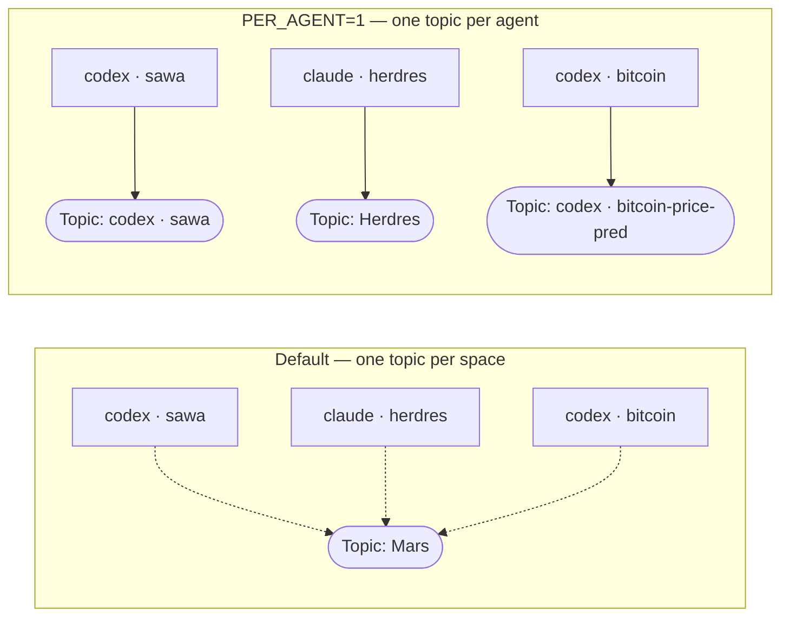
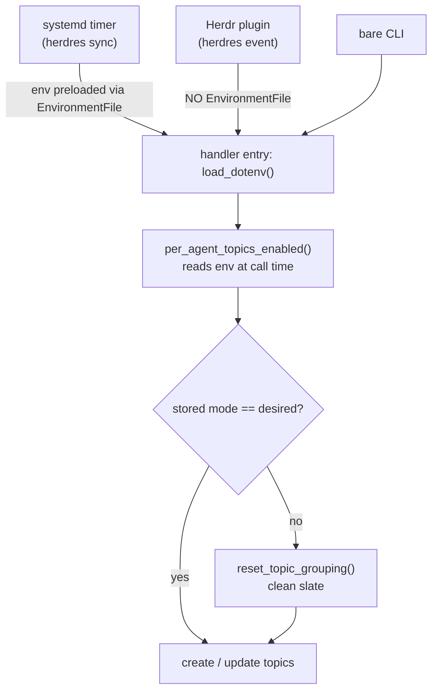
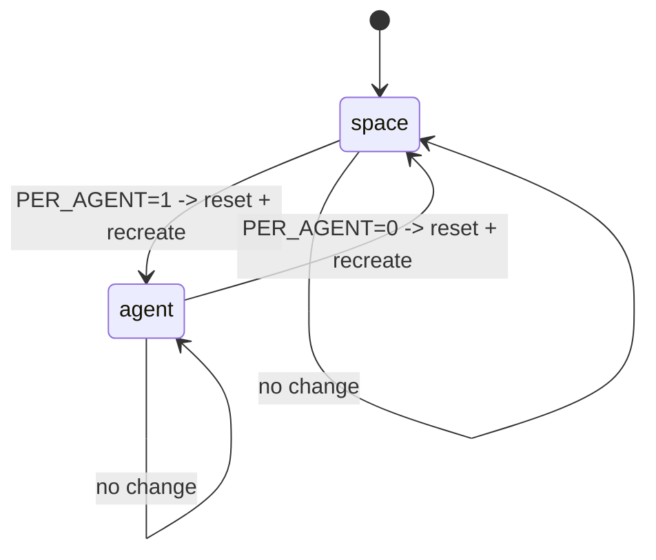
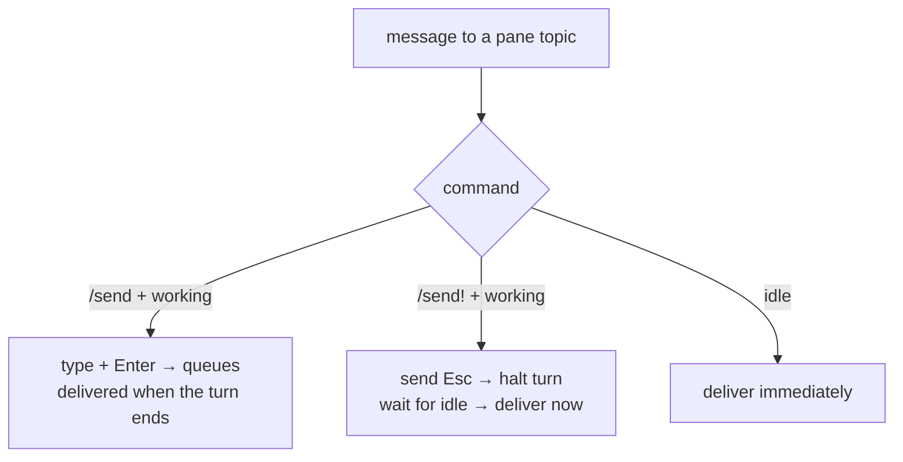
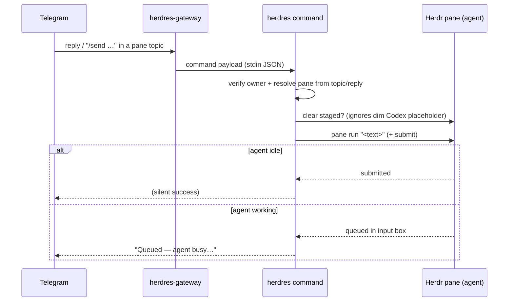

# Per-agent Telegram topics & pane control

This document describes the Telegram ↔ Herdr control layer added on top of the
base bridge: **one forum topic per Herdr agent**, and how messages you send from
Telegram reach a pane (including when the agent is busy). It covers four
changes:

| Change |
|--------|
| Per-agent Telegram topics (`HERDR_TELEGRAM_TOPICS_PER_AGENT`) |
| Treat input queued behind a busy agent as *queued*, not a send failure |
| `/send!` — interrupt a busy agent and deliver now |
| Don't treat Codex's dimmed placeholder as staged input |

---

## 1. Topic granularity: per-space vs per-agent

By default Herdres maps each Herdr **workspace** to a single forum topic, so
every agent in a space lands in one thread. Set
`HERDR_TELEGRAM_TOPICS_PER_AGENT=1` to instead get **one topic per Herdr agent
(pane)**, named `<agent> · <folder>` (a manual pane label wins).



### Why the flag is read at runtime (not import time)

Herdres runs in three contexts, but only systemd injects env before Python
starts. The **Herdr plugin** runs `herdres event` with **no** `EnvironmentFile`,
so an import-time constant would read `False` under the plugin and silently
re-collapse every agent back onto one topic. `per_agent_topics_enabled()` reads
the env **at call time** (after each handler's `load_dotenv()`), so all three
contexts agree.



### Switching modes is a clean slate

Flipping the flag triggers a one-time `reset_topic_grouping()` that wipes the old
topic→pane mappings and rebuilds fresh; old Telegram topics are left in place for
manual deletion. The reset is reconciled on **every** topic-creating path
(`sync_once` **and** `event_once`), so it can't half-apply.



Topic creation is rate-limited by `HERDR_TELEGRAM_TOPICS_MAX_CREATES` (default 3
per run). For a one-shot backfill of N agents:
`HERDR_TELEGRAM_TOPICS_MAX_CREATES=N herdres sync`.

---

## 2. Sending a message to a pane

Reply inside a pane's topic with `/send <text>` (or the pane's root card). An
agent processes **one turn at a time**, so a message sent while it's `working`
can only **queue** or **interrupt** — there's no way to inject into a turn that's
already running.

| Command | Idle agent | Working (busy) agent |
|---|---|---|
| `/send <text>` | ✅ delivered immediately | ⏳ **Queued** — runs when the current turn ends |
| `/send! <text>` (aliases `/interrupt`, `/isend`) | ✅ delivered (no Esc — nothing to interrupt) | ⏹️ **interrupts** the turn (Esc) and delivers **now** |

`/send` to a busy agent queues the message (it is **not** lost — it's delivered
at the next turn boundary) and replies *"Queued — the agent is busy…"*. This was
previously reported as a scary `Send failed`.



`/send!` only sends `Esc` when the agent is actually `working` (interrupting an
idle agent is needless, and on Codex it would pop the "edit previous message"
recall preview).

---

## 3. The Codex placeholder fix

Codex shows **dimmed example suggestions** (`Explain this codebase`,
`Summarize recent commits`, …) in an **empty** input box. The staged-input
detector read pane output with ANSI stripped, so it couldn't tell a greyed
placeholder from real typed text — it thought the box was full and refused the
send with `Could not clear existing staged pane input`.

The fix reads the input with **raw ANSI** (`pane_input_ansi`) and treats a prompt
whose suggestion carries the SGR **dim** code (`ESC[2m`) as an empty box. Real
typed input is not dim, so it's still detected as staged.

```mermaid
flowchart TD
  R["read pane input (raw ANSI)"] --> A{prompt line has text?}
  A -->|no| EMPTY["not staged → send proceeds"]
  A -->|yes| D{text is dim (ESC[2m)?}
  D -->|yes → Codex placeholder| EMPTY
  D -->|no → real typed text| ST["staged → handled (clear / queue)"]
```

---

## 4. Command reference

| Command | What it does |
|---|---|
| `/send <text>` | Forward to this pane (queues if the agent is busy) |
| `/send! <text>` | Interrupt the current turn and deliver now (aliases `/interrupt`, `/isend`) |
| `/status`, `/report` | Latest clean report / question |
| `/choices` | Resend active choices or decision buttons |
| `/raw [lines]` | Sanitized raw visible output |
| `/keys <keys>` | Send explicit keys to the pane |
| `/debug` | Technical mapping details |
| `/help` | List commands |

---

## 5. Configuration reference

| Env var | Default | Purpose |
|---|---|---|
| `HERDR_TELEGRAM_TOPICS_PER_AGENT` | `0` | One topic per agent (vs per space) |
| `HERDR_TELEGRAM_TOPICS_MAX_CREATES` | `3` | Max topics created per sync run |
| `HERDR_TELEGRAM_TOPICS_PANE_ROOT_MESSAGES` | `0` | Stable per-pane root card to reply to |
| `HERDR_TELEGRAM_TOPICS_INCLUDE_SHELLS` | `0` | Also map panes with no agent |
| `HERDRES_GATEWAY_DEBUG` | _(off)_ | Verbose gateway routing trace |

---

## 6. How an inbound message flows



The gateway long-polls Telegram and pipes each in-topic message/callback to
`herdres command` / `herdres callback`; it spawns a fresh `herdres` per message,
so code changes take effect without restarting the gateway.
